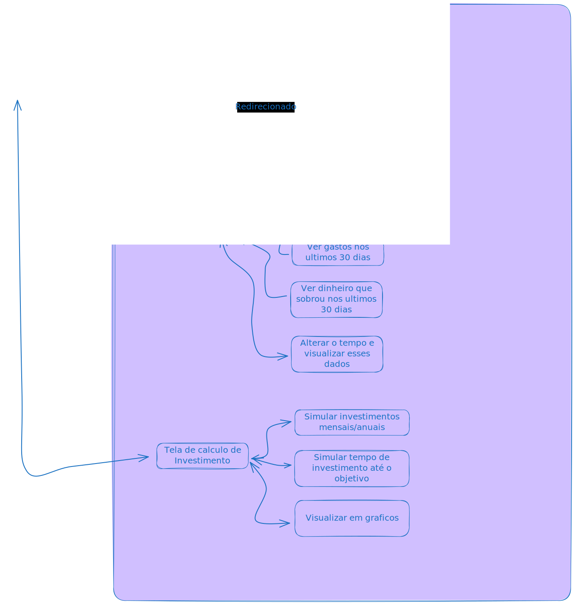
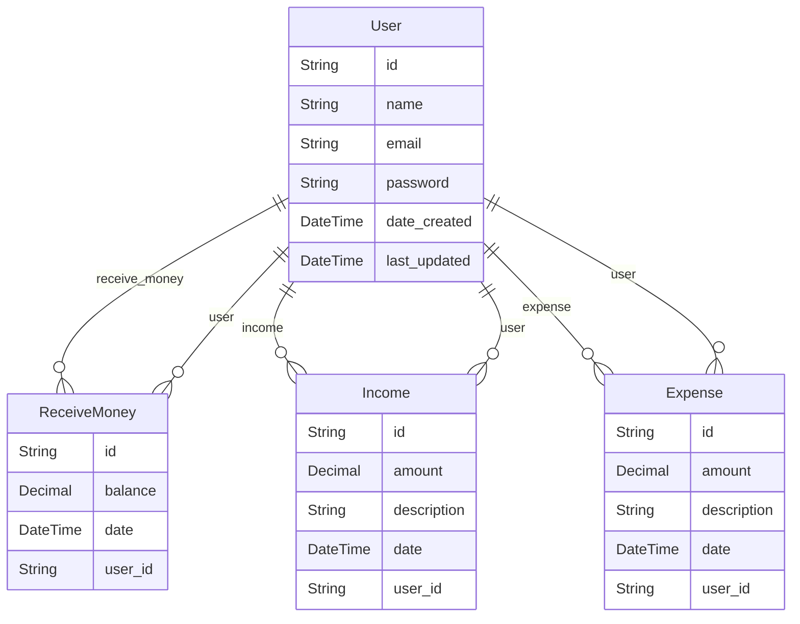

<h1 align="center"></h1>

  

    <strong>Saiba para onde o seu dinheiro está correndo</strong>
  

## Objetivo
Invisti é um site/app para quem quer começar a investir, mas no final do mês percebe que não resta nada em sua carteira, então esse site foi pensando para essas pessoas terem um controle sobre seu dinheiro, ver suas despezas e cortar gastos desnecessarios.

## Como contribuir com o projeto
O projeto é livre para que qualquer tipo de contribuição seja bem vinda.
Caso tenho vontande em contribuir com o projeto, 
[Click aqui para seguir os passos](./Contribuir.md).

## Tecnologias utilizadas
### Backend
- Typescript
- Node
- Expess
- PrismaOrm
- jsonwebtoken
- cors
- bcrypt
### Frontend
- Typescript
- React
- Axios
- Cookies-ts

## Diagrama de caso de casi de uso

## Diagrama de classe

